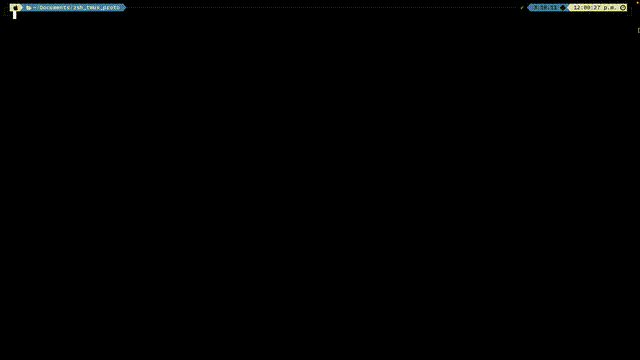

# Jsonux

> A terminal-based JSON exploration tool using `tmux`, `jless`, `jq`, and your favorite editor (`nvim` by default).  
> Visually split your JSON file, write jq filters interactively, and preview results — all from a terminal layout.


---

## 🧩 Features

- View original JSON side-by-side with your jq-filtered output
- Use Neovim to edit jq filters in a dedicated pane
- Instantly re-run filters with a single key (prefix + `r`)
- Supports multi-line jq filters
- Optional: provide your own jq filter file

---

## 🖥️ Setup (macOS and Linux)

### ✅ Requirements

Install these tools if not already installed:

#### macOS (via Homebrew):

```bash
brew install tmux jq jless neovim
```
#### Linux (Debian/Ubuntu):
```bash
sudo apt update
sudo apt install tmux jq neovim
# jless isn't in apt; install manually:
curl -LO https://github.com/PaulJuliusMartinez/jless/releases/latest/download/jless-x86_64-unknown-linux-gnu
chmod +x jless-*
sudo mv jless-* /usr/local/bin/jless
```
## ⚙️ Install the Script
### 1. Download or copy the script file (e.g. jsonux) to a known location:
```bash
curl -Lo ~/bin/jsonux https://raw.githubusercontent.com/Deep-Adhikary/jsonux/main/jsonux
```
### 2. Make it executable:

```bash
chmod +x ~/bin/jsonux
```
### 3. Ensure the path is in your shell profile:
For Zsh (~/.zshrc):

```bash
export PATH="$HOME/bin:$PATH"
```
For Bash (~/.bashrc or ~/.bash_profile):
```
export PATH="$HOME/bin:$PATH"
```
Then reload:

```bash
source ~/.zshrc     # or source ~/.bashrc
```
## 🚀 Usage

```bash
jsonux <path/to/json-file> [optional/path/to/filter.jq]
```
### Examples
```bash
# Use default temp filter
jsonux data.json

# Use your own saved jq filter file
jsonux data.json filters/product-filter.jq
```
## 🎮 Controls

| Key Combination         | Action                                 |
|------------------------|----------------------------------------|
| `<Tmux Prefix Key>` + `r` | Re-run the jq filter and refresh output |
| `<Tmux Prefix Key>` + `z` | Toggle zoom on current pane             |
| `<Tmux Prefix Key>` + `c` | Create new tmux window                  |
| `<Tmux Prefix Key>` + `q` | (Optional) Quit shortcut if you add binding |

## 📂 Layout

```pgsql
+-------------------------+-----------------------------+
|                         |                             |
|   jless (original JSON) |   jless (jq output)         |
|                         |-----------------------------|
|                         |   nvim (jq filter)          |
+-------------------------+-----------------------------+
```
## 🧠 Notes
- If no filter file is provided, a temp file at /tmp/jq_filter.jq is created and loaded in Neovim.
- Pressing prefix `+ r` re-runs the current filter from the jq file and refreshes the top-right output pane.
- **Standard `tmux` and `jless` commands work as well** — feel free to navigate, zoom, split, or search as you normally would.

## 📜 License
MIT — use freely, modify joyfully.

## 🙌 Credits

Built with ❤️ using:

- [tmux](https://github.com/tmux/tmux) — terminal multiplexer
- [jq](https://github.com/stedolan/jq) — powerful JSON processor
- [jless](https://github.com/PaulJuliusMartinez/jless) — command-line JSON viewer
- [neovim](https://github.com/neovim/neovim) — hyperextensible Vim-based text editor
